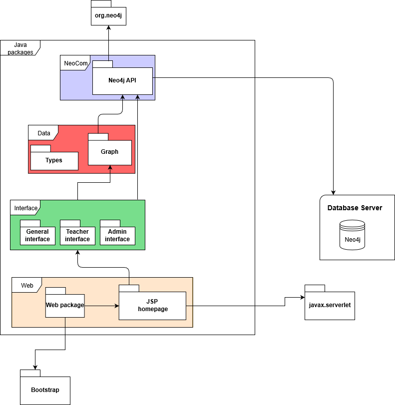

<h1>Knowledge Traceability in Higher Education</h1>

Tommy Andersson - anetom-6@student.ltu.se 
Robin Danielsson - robdan-7@student.ltu.se 
Marcus Eriksson - amueri-6@student.ltu.se 
Wilma Krutrök - wilkru-7@student.ltu.se 
Jesper Nilsson - ejeino-7@student.ltu.se 
Johan Rodahl Holmgren - ojaohe-3@student.ltu.se 

  
    January 8, 2020

## 1. Introduction
This report is part of an assigned project in the course “*Project in computer science and engineering*”. The purpose of the project is to give students, teachers and student counsellors a tool for viewing and evaluating information about the knowledge given in different courses. The tool itself will hopefully provide students with a wider understanding of how different courses are connected and why parts of them are important for future studies. Teachers will be able to see how changing a part of a course would affect other courses given to the same students.

### 1.1. Background

Project owner Jan van Deventer stated a problem with students not having the knowledge needed when the course starts. To solve this problem Jan wanted a software for teachers to easily see what the students know and how long time has passed since they took a course with a specific “knowledge component”. The software should also be used by students to keep track of the importance to learn specific parts of courses.

One attempt to solve this problem has been done. The solution was using Google Sheets and Matlab which turned out to be very inefficient. One big challenge was that teachers named the knowledge components differently, resulting in chaos. The program was not able to see if something was misspelled, used shortening or other similar things. 

### 1.2. Problem description
The main problems are divided into different parts. One is that some courses overlap while others have a missing link, i.e. the knowledge required for one course is not given in previous courses. And certain prerequisites are not obvious between courses since some details are not written in the course description. When interviewing the teachers it became apparent that most of them had, at least once, encountered the problem were most students had not been given the knowledge required for some part in a course. 

### 1.3. Assignment
To solve the problem a software will be implemented. The software will be web based and interactive. Users should be able to search for programs and courses to see how the courses are connected and what knowledge component each course require and give. This will motivate the user group students, and help all user groups to plan the optimal course order. Teachers should be able to see what knowledge components they should teach and on what level. 

### 1.4. Delimitation
Because of the limited time set the project group will not focus on collecting the data that is needed for the solution to work. This job will be placed on the examiners together with a group of engaged teachers. The system will not be fully integrated with the system the university is currently using. 

1

## 2. System Design
The software is planned to be implemented as a Java program utilizing a graph database Neo4j. In that way classes and objects can be implemented as related components. Java also got the libraries needed to communicate with a Neo4j. Courses and knowledge components will be implemented as objects with different parameters and represented as nodes in Neo4j. Courses will be connected to knowledge components containing the taxonomy level. It will also make it possible to make the connections between the different objects clearer and easier to change.

All the data about the courses and the knowledge components will be stored in a Neo4J[1](#footnote) database with the same structure as in the node objects. The reason for choosing Neo4J is because it is fast with graph relationships and the way it is constructed makes it easy to create and connect nodes. Storing the data in a database will give a good overview and access to the data. Connection to the front-end program from the Java program will go through a server.

Figure 1: Overview of the program structure by a module diagram.

<a name="footnote">1</a>: Neo4J website. 2019-12-11. [https://neo4j.com](https://neo4j.com)

2

Figure 1 is an overview of our system design. The user will access the system using a web browser. The Java program will contain a JSP (Java Server Pages) class running in a Tomcat container and connect to the web browser using HTTP requests. All database communication will be handled by the Java program. Courses and knowledge components will be represented as nodes in a graph. Using this method it will be easy and fast to make changes in the graph and return the changes back to the user. 

# 3. Implementation

## 3.1. Working module

SCRUM has been used every time the group has worked together. For these meetings a SCRUM master has been decided which control the pace of the meetings. Every person must answer three questions: What have you done? Is there something you want help with? What will you do until the next meeting? The person should answer truthfully for the development to carry on. If complications occur it is important what the team can do to make it better and not who to blame for it. The meeting should take around 15 minutes if not something critical has happened since the last meeting.

GitHub issues has been used for group members to know which function is most critical to finish for the development to move on. New issues will be made if the group members find that some functions are missing. Each issue will have a weight and the lower the digit the higher the priority, where 0 is the highest priority. When a function is tested and considered safe it will be closed.  

## 3.2. Project implementation

To work with the project the group have regular meetings where the scrum master leads the meeting, assign tasks and have the final word when voting. All tasks are assigned as issues in GitHub together with the documentation. The Git master has responsibility to merge everything into the master branch and to make sure everything is correct. Once a week a follow up meeting with the project owner is scheduled. At the meeting the work since last time is presented and feedback is received. After the feedback the group together with the project owner discuss what should be done until the next meeting.

## 3.3 Resource and activity planning

The project has been divided into two themes, backend and frontend. Backend will be covered in sprint 1 where stories and tasks considering storing, searching and modifying data in the database will be handled. For sprint 2 the frontend will be made including the user interface.

### 3.3.1. Sprint 1

The theme for sprint 1 will be the backend for the system. It will include all functions in the java program to the database. 

#### Story 1

**Title:**
Write to the Neo4j database using our server program.

**Intended use:**
Will be used to write data from the Java program into the database. Example creating a new course or a new knowledge component.

**Desired properties:**
It is important that it is working correctly and not overwriting data that exists in the database. The structure for the nodes that is stored needs to be correct and the functionality must be implemented in an efficient way.

**Test case:**
Run a test bench that is creating new nodes and stores them into the database using all available functions. 

##### Tasks

###### 1.1
**Description:** Store a new course in the database 
**References tasks:** None 
**Estimated time:** 6 h 
**Estimated risk:** 8/10 

###### 1.2
**Description:** Store a new KC in the database 
**References tasks:** None 
**Estimated time:** 6 h 
**Estimated risk:** 8/10 

###### 1.3
**Description:** Create and store a new user 
**References tasks:** None 
**Estimated time:** 5 h 
**Estimated risk:** 8/10 

###### .4
**Description:** Store a new topic 
**References tasks:** None 
**Estimated time:** 4 h 
**Estimated risk:** 7/10 

###### 1.5
**Description:** Store a new course program 
**References tasks:** None 
**Estimated time:** 10 h 
**Estimated risk:** 7/10 

**Risk for the story:** 8/10

#### Story 2

**Titel:**
Search in the database

**Intended use:**
Search the database for data. This will be used when user searches for program and all the courses are to be linked together. This will also be used when admin and teachers are to login to modify courses or add new ones.

**Desired properties:**
It returns correct values with no possible way to alter other functions.No value (null) shall be returned if no data was found.

**Test case:**
Rigorous search tests to see that the database returns the correct values. Stress test it with input that should be illegal.

##### Tasks

###### 2.1
**Description:** Search for courses in the database 
**References tasks:** 1.1 
**Estimated time:** 3 h 
**Estimated risk:** 2/10 

###### 2.2
**Description:** Search for KC in the database 
**References tasks:** 1.2 
**Estimated time:** 2 h 
**Estimated risk:** 1/10 

###### 2.3
**Description:** Search for users in the database 
**References tasks:** 1.3 
**Estimated time:** 4 h 
**Estimated risk:** 5/10 

###### 2.4
**Description:** Search for topics in the database 
**References tasks:** 1.4 
**Estimated time:** 3 h 
**Estimated risk:** 2/10 

**Risk for the story:** 5/10

#### Story 3

**Title:**
Modifying database content

**Intended use:**
When a course or knowledge component is to be altered, a connection to the database is established and the desired data is modified. 

**Desired properties:**
There will be no alternation if there exists no such entry in the database to begin with. The user must also be verified and have the rights to modify the database.

**Test case:**
Manual testing that includes deleting and modifying objects in the database. The same tests must also be done as a user without permission.

##### Tasks

###### 3.1
**Description:** Modify course content in the database 
**References tasks:** 2.1 
**Estimated time:** 3 h 
**Estimated risk:** 7/10 

###### 3.2
**Description:** Modify KC content in the database 
**References tasks:** 2.2 
**Estimated time:** 2 h 
**Estimated risk:** 7/10 

###### 3.3
**Description:** Modify existing user credentials 
**References tasks:** 2.2 
**Estimated time:** 4 h 
**Estimated risk:** 9/10 

###### 3.4
**Description:** Modify course program content. 
**References tasks:** 1.5 
**Estimated time:** 3 h 
**Estimated risk:** 7/10 

**Risk for the story:** 9/10

#### Story 4

**Title:**
Setup the Neo4j server. 

**Intended use:**
The database that will store all the data for the system. This includes courses, knowledge components, student programs, system users, topic and more. 

**Desired properties:**
Needs a lot of memory and high reliability. It also needs to be configured with correct access from a security viewpoint. 

**Test case:**
Run tests to check it is accessible for the server computer and not from other computers.  

##### Tasks

###### 4.1
**Description:** Install the server software on the server machine 
**References tasks:** None 
**Estimated time:** 5 h 
**Estimated risk:** 10/10 

###### 4.2
**Description:** Give the correct access 
**References tasks:** None 
**Estimated time:** 3 h 
**Estimated risk:** 10/10 

**Risk for the story:** 10/10

### 3.3.2. Sprint 2

The theme for this sprint is the system frontend. Here the web browser will be set up and the user interface will be in focus. 

#### Story 5

**Title:**
Displaying the Graph

**Intended use:**
Let users see results in an “easy to the eye” graph, with isolation of data.

**Desired Properties**
Courses and knowledge components should be displayed clear and plain on to the page.

**Test case:**
Third party program that intended for testing on frontend. Other than that manual testing by viewing and testing result.

##### Tasks

###### 5.1
**Description:** Display Course order on page 
**References tasks:** 2.* , 4.* 
**Estimated time:** 15 h 
**Estimated risk:** 5/10 

###### 5.2
**Description:** Connect courses and knowledge components 
**References tasks:** 5.1 
**Estimated time:** 8 h 
**Estimated risk:** 5/10 

###### 5.3
**Description:** Application protocol to communicate to server, fetch new and publish data 
**References tasks:** 5.2 
**Estimated time:** 6 h 
**Estimated risk:** 4/10 

**Risk for the story:** 5/10

#### Story 6

**Titel:**
Logging in 

**Intended use:**
Logging in an existing user by using the individuals username and password.  

**Desired properties:**
Two text bars where you write username and password and a button for logging in, also a system for account recovery

**Test case:**
Registering an account then trying to log in if it fails then something is wrong, either username, password or something else that needs a closer look.

###### Tasks

###### 6.1
**Description:** Logging in 
**References tasks:** 2.* 
**Estimated time:** 6 h 
**Estimated risk:** 4/10 

###### 6.2
**Description:** Account recovery 
**References tasks:** None 
**Estimated time:** 8 h 
**Estimated risk:** 4/10 

###### 6.3
**Description:**  Register Account 
**References tasks:** 1.3 
**Estimated time:** 8 h 
**Estimated risk:** 8/10 

**Risk for the story:** 8/10

#### Story 7

**Title:**
Search data from database via web browser

**Intended use:**
Users should be able to display data from database for example when searching for a program, course or knowledge component. 

**Desired properties:**
The functions for this story should not affect other parts of the program. It should be simple and user friendly.

**Test case:**
Run a test program that search for a student program and get the desired overview over the course plan.

##### Tasks

###### 7.1
**Description:** Search for knowledge component or course 
**References tasks:** 2.* 
**Estimated time:** 10 h 
**Estimated risk:** 2/10 

###### 7.2
**Description:** Search for program with specialization 
**References tasks:** 2.* 
**Estimated time:** 6 h 
**Estimated risk:** 2/10 

**Risk for the story:** 2/10

#### Story 8

**Title:**
Modify data in database via web browser

**Intended use:**
Make it possible for users to add/change courses and knowledge components. It should also be possible to add or remove relationships between courses and knowledge components. 

**Desired properties:**
Should be implemented correctly to go via java program functions and not directly to database. Need to be user friendly and catch errors.

**Test case:**
Run tests with different inputs and compare with expected result.

##### Tasks

###### 8.1
**Description:** Add course 
**References tasks:** 1.* 
**Estimated time:** 10 h 
**Estimated risk:** 5/10 

###### 8.2
**Description:** Remove knowledge component from course 
**References tasks:** 2.*, 3.2 
**Estimated time:** 8 h 
**Estimated risk:** 6/10 

###### 8.3
**Description:** Edit information for knowledge component 
**References tasks:** 2.*, 3.2 
**Estimated time:** 8 h 
**Estimated risk:** 5/10 

**Risk for the story:** 6/10

## 3.3.3. Reflections, planning, implementation and time tracking

# 4. Result

## 4.1. Delivery

## 4.2. Testing

### 4.2.2. Regression risks

When updating the software there is a risk for features to stop functioning. Based on how the user input is handled in functions together with the information in the database, seen in system design - section 2, the following regression risks are considered. 

#### Local regression

Changing a function can result in a bug appearing in the function. One such thing is that the input to the database is not secured and allows incomplete queries. It looks like the data is added to the database when it is not. This error is hard to discover, but the current solution to mitigate the possibility of this kind of regression is the usage of an interface between the server and the rest of the system. However, if this interface were to have a risk of regression the rest of the system could be at risk as well.

Another local regression risk is caused by any inconsistency in variable names between the database and the client. A direct consequence is that the values can not be accessed from the desired variables or the returned values will not be stored or used in the wanted way. But this problem should also be prevented by the server API, since only one part of the software will be responsible for interfacing with the database.

#### Unmasked regression

It is important that all functions are designed to minimize bugs. Meaning it should be able to handle non valid input. Otherwise a new function can introduce new bugs in previous implemented functions. Unmasked regression can occur when the input used is changed and the function is not handling the new input. If a function is designed only for specific inputs it must throw an exception if the input is invalid.

For example, if a function is designed to iterate over an array, it must throw an exception if an empty array is the input. To make this work it is important that each function have a specification for the inputs it can handle, and also that it is tested for all the inputs. All the communication to the database goes through the Neo4J API and this reduces the risk for unmasked regression in the database. The package Graph could possibly unmask bugs for relations in the database or in functions for the package Neo4J API.

3

#### Remote regression

A certain function could be edited in a way that breaks some other function because the behaviour is different. Whenever some function is changed, that function must retain the same behaviour as specified in the specification. If the behaviour is different it could cause unwanted results in other functions that rely on the code that was altered. E.g. if component A writes to the database while component B reads from it, there is a possibility that a change in A causes the output to be altered, or even corrupted, thus breaking B. Therefore, the database API must write and read in a unified fashion in order to minimize the risk of bugs between the rest of the software and the server.

These regressions show that it is important to have a well defined structure over the database and how the system should interact with it. It is also important to specify what all functions takes as parameters, does and returns. All invalid inputs should be handled, or at least be clearly stated in the documentation of what the function can and cannot handle. 

### 4.2.3. Strategy for regression testing

To test the system to avoid regression a strategy is to have a set of predefined input and output. When a new function is implemented the set is tested to see if the right output is given to guarantee no new bugs have been introduced. When a bug is discovered it will be fixed and put on a high risk list to be checked regularly to see that it does not create or handle new bugs. 

#### Traceability

A selection of tests are made to ensure that the software behaves like it is supposed to. Tests for the documented quality risks will also be used. To be able to conduct these tests, activity charts and sequence charts for the functions are needed. 

In the software development a third party application (automatic testing) will help in identifying issues with current development. All code will be placed in a development branch where it will be tested with a set of predetermined variables and types. Before the test the function will be analyzed to see how the function should behave and the test result will be noted. If all checks are clear the function will be considered stable and put in a compile Branch for further testing.

#### Change analysis

Since the code interface with the database, any mistake has the possibility to grow and eventually reach the database. If the graph were to crash or produce an anomaly, data could be stored in the database if the process has teacher privileges. A change in the graph node classes could also cause unwanted behaviour. The graph could be rendered incomplete, or not at all if the mistake is severe enough.

In order to prevent these problems every possible output a changed function or object can generate needs to be analyzed. The output must then be used as input to every component that utilizes said function. E.g. if an if-statement in a function creates a new code path, that code path will have its own set of possible outputs that may be different from what some other function expected. The same situation can be created by a thrown error that did not exist before. It is therefore important to test for regressions when the specification of a function or class is altered in a way that does not affect functionality unless there is some initial error.

4

#### Quality risk analysis

There is a moderate risk that bugs that are damaging appear inside the web application or backend system. Additional risk is asserted in the fact that there is not enough user support to make the application useful in some cases, this however is a low damage but high risk. If the project is completed earlier than expected, the final application might have this issue resolved. 

Conflict of data storage; since having multiple database solutions and neo4j being quite unfamiliar and utilizing the other database, there is a high risk of conflicting entries unless final application solves the issue by other means. 

The issue of knowledge components is that it has to be arbitrarily inserted by teachers via system administrators. Main issue is, even with good fundamental structure duplication of KCs might occur. Additionally the issue of inserting all KCs might be a too large of a task with low risk. 

To avoid risking the quality for the user and to reduce the business risk it is important to have a good documentation. To do so the functions should be well documented, containing a description together with stating the input, output and assumptions. It is also important to have well descriptive names for functions and variables. The predefined input should cover the expansion of the software to guarantee the low business risk.

#### Cross-functional testing

Cross-functional testing is done by testing different functions which should not affect each other in a test suite. By doing this the expected result would be the same as running the functions in isolation. If the result is not the same, it means that the functions contains a bug. Using this function a tester can focus on areas of the software that contained bugs in previous test. This will ensure that no new bugs were created when the old ones were fixed. The software will be web-based and handle multiple users at once. When handling more than one user it is always important to lock global variables when using them. The strategy that will be used is a wide search for bugs, for example check global variables or functions used by other functions. If a bug is discovered it will be fixed and added to the high risk list.

### 4.2.4. Development description

To test the system for regression the following stories for automated unit level and automated system level testing have been described. The stories are divided into tasks, with estimated time to finish, priority to be finished and risk. Where risk is defined as a summary of different requirements, implementation and dependency risks. 

#### Automated unit level testing

Unit level testing is small parts of a code tested in isolation to make sure that the modules are working properly. This will make it easier to detect bugs and this kind of testing is usually performed by developers. 

##### Story 1

**Title:** Test of the Neo4J API.  **Intended use:** Automatically create, edit and delete nodes and relationships using the developed API.  **Desired properties:** Will cover all possible inputs for the API.  **Test case:** Run the test with both valid and invalid input  **Estimated time:** 18h, **Risk:** 8/10, **Prio:** High.

5

##### Tasks

###### 1.1

**What to do:** Create a script that starts the Neo4J module. 

**Estimated time: ** 4h, **Risk:** 8/10, **Dependency: ** No dependency

###### 1.2

**What to do:** Make a script to create, modify and remove KC, program and courses in the module Neo4J. 

**Estimated time:** 9h, **Risk:** 8/10, **Dependency:** No dependency

###### 1.3

**What to do:** Create a script that checks if the data in the database is correct after create, modify and remove KC, program and courses in the module Neo4J. 

**Estimated time:** 5h, **Risk:** 1/10, **Dependency:** No dependency

#### Automated system level testing

System testing involves several modules in one test. It could be used to test a function for the user to execute that will start functions in other modules of the system to give the asked output. 

##### Story 2

**Title:** 

Automatic test of all functions involved when getting a graph from the database containing a student program.   

**Intended use:** Run a request for all available programs to make sure that all inputs gives the expected output. 

**Desired properties:** Will be easy to setup for testing. 

**Test case:** Test should be ran with different input, both correct and input that should not work. 

**Estimated time:** 8h, **Risk:** 4/10, **Prio:** High

##### Tasks

###### 2.1

**What to do:** Develop a python script to call the system with all possible inputs and some invalid input. 

**Estimated time:** 4h, **Risk:** 4/10, **Dependency:** No dependency

###### 2.2

**What to do:** Use the script from above to check that the graphical view is working. 

**Estimated time:** 4h, **Risk:** 4/10, **Dependency:** No dependency

6

